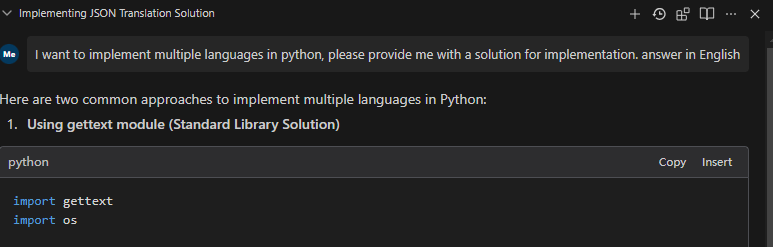

# MCP Interactive Service

This is an MCP service implemented using the FastMCP library, designed for interaction with AI tools like Cursor, Windsurf, etc. When AI tools need user input or option selection while calling large language models, they can invoke this MCP service.




## Core Purpose

The core purpose of this plugin is to enable high-frequency communication and confirmation between AI tools (like Cursor and Windsurf) and users. It significantly improves the efficiency and effectiveness of AI interactions by:

1. **Reducing Wasted Resources**: By allowing users to confirm or redirect AI's approach before it commits to a potentially incorrect solution path, the plugin minimizes wasted API calls and computational resources.

2. **Maximizing Resource Utilization**: Every API call to Cursor or Windsurf becomes more productive as the AI can verify its understanding and approach with the user before proceeding.

3. **Preventing Attention Fragmentation**: By confirming approaches early, the plugin helps maintain focus on the correct solution path rather than having attention diverted to incorrect approaches.

4. **Enabling Interactive Decision Making**: Users can actively participate in the decision-making process, providing immediate feedback and guidance to the AI.

5. **Streamlining Complex Tasks**: For multi-step tasks, the plugin ensures alignment between user expectations and AI execution at each critical decision point.

## Features

- **Option Selection**: Display a list of options for users to select by entering numbers or providing custom answers
- **Information Supplement**: When AI models need more complete information, they can request users to directly input supplementary information
- **Multiple User Interfaces**: Support for CLI, Web, and PyQt interfaces

## UI Types

This project supports three different user interface types, each with its own characteristics:

### CLI (Command Line Interface)

- **Description**: Opens a new command prompt window for user interaction
- **Advantages**:
  - Minimal dependencies (no additional packages required)
  - Can handle multiple dialog windows simultaneously
  - Works well in environments without graphical interfaces
  - Lightweight and fast to start
- **Disadvantages**:
  - Basic visual presentation
  - May not be as intuitive for non-technical users
- **Best for**: Server environments, systems with limited resources, or when multiple simultaneous dialogs are needed

### PyQt Interface

- **Description**: Provides a modern graphical user interface using PyQt
- **Advantages**:
  - Clean, professional-looking dialogs
  - Familiar desktop application experience
  - Easy to use for all user types
- **Disadvantages**:
  - Can only display one dialog at a time
  - Requires PyQt dependencies (larger installation)
- **Best for**: Desktop use where visual appeal is important and only one dialog is needed at a time

### Web Interface

- **Description**: Opens dialogs in a web browser
- **Advantages**:
  - Can handle multiple dialog windows simultaneously
  - Accessible from anywhere via web browser
  - Modern, customizable interface
- **Disadvantages**:
  - Requires web browser to be installed
  - Slightly more complex setup
- **Best for**: Remote access scenarios, environments where a web interface is preferred, or when multiple simultaneous dialogs are needed

## Usage Guide

### 1. Install Dependencies

This project separates dependencies based on different UI types:

- `requirements-base.txt`: Base dependencies, shared by all UI types
- `requirements-pyqt.txt`: PyQt5 UI dependencies
- `requirements-web.txt`: Web UI (Flask) dependencies

You can choose to use either traditional pip or the faster uv package manager to install dependencies.

#### Using pip (Traditional Method)

Choose the appropriate dependency file based on the UI type you want to use:

```bash
cd requirements
# CLI UI (minimal dependencies)
pip install -r requirements-base.txt

# PyQt5 UI
pip install -r requirements-pyqt.txt

# Web UI
pip install -r requirements-web.txt
```

Note: Each specific UI dependency file already includes a reference to the base dependencies (via `-r requirements-base.txt`), so you only need to install a single file.

#### Using uv (Recommended, Faster)

If you already have [uv](https://github.com/astral-sh/uv) installed, you can use the following commands to create a virtual environment and install dependencies:

```bash
# Create a virtual environment
uv venv

# Activate the virtual environment
# Windows
.venv\Scripts\activate

# macOS / Linux
source .venv/bin/activate

# Install dependencies based on UI type
cd requirements

# CLI UI (minimal dependencies)
uv pip install -r requirements-base.txt

# PyQt5 UI
uv pip install -r requirements-pyqt.txt

# Web UI
uv pip install -r requirements-web.txt
```

You can also use the project's pyproject.toml file to install all dependencies directly:

```bash
# Install base dependencies
uv pip install -e .

# Install specific UI type dependencies
uv pip install -e ".[pyqt]"     # PyQt5 UI
uv pip install -e ".[web]"      # Web UI
uv pip install -e ".[all]"      # All UI types
```

### 2. Start the Program

Start different UI response methods:

```bash
# Command line interface (default)
python main.py run --ui-type=cli

# Web interface
python main.py run --ui-type=web

# PyQt interface
python main.py run --ui-type=pyqt
```

Other service startup options:

```bash
# Start the service with default settings (address: 127.0.0.1, port: 8000)
python main.py run

# Specify host and port
python main.py run --host 0.0.0.0 --port 8888

# Specify log level
python main.py run --log-level debug
```

### 3. Configure Cursor or Windsurf

#### Using SSE Protocol (Recommended)

Local startup:
```bash
python main.py run --transport sse
```

Cursor configuration:
```json
{
  "ai-interaction": {
    "type": "sse",
    "url": "http://127.0.0.1:8000/sse",
    "env": {}
  }
}
```

Windsurf configuration:
```json
{
  "ai-interaction": {
    "serverUrl": "http://127.0.0.1:7888/sse",
    "disabled": false
  }
}
```

#### Using stdio Protocol (Not Recommended)

```json
{
  "cursor-interaction": {
    "command": "python",
    "args": ["path/to/main.py","run","--transport","stdio"],
    "env": {}
  }
}
```

### 4. Configure AI Interaction Rules

To maximize the effectiveness of AI interactions in Cursor and Windsurf, configure the following rules for AI to follow when using MCP:

1. When the AI is unclear about a task or needs additional information, it should call MCP ai-interaction to request clarification from the user.

2. When the AI has multiple possible approaches to a solution, it should call MCP ai-interaction to let the user select the preferred approach.

3. After completing a task, the AI should call MCP ai-interaction to confirm whether there are other tasks that need to be executed.

4. The AI should break down tasks into multiple stages and before starting a new stage, call MCP ai-interaction to ask the user if any additional thoughts or considerations need to be incorporated.

5. The AI should proactively use MCP to confirm critical decisions rather than making assumptions.

These rules ensure high-quality, interactive AI assistance while maximizing the value of each API call.

### Other Functions

#### View Available Tools

```bash
python main.py list-tools
```

#### Test Tools

```bash
# Test option selection tool
python main.py test select_option

# Test information supplement tool
python main.py test request_additional_info
```

#### Interactive Test Client

The project includes an interactive test client that allows you to test the MCP service with different UI types and methods:

```bash
# Run the interactive test client
python mcp_client_en.py --host localhost --port 7888 --ui cli
```

Options:
- `--host`: Server host (default: localhost)
- `--port`: Server port (default: 7888)
- `--ui`: UI type to use (cli, pyqt, web)

The client provides:
- Connection testing with MCP service
- Selection of UI type to test with
- Testing both select_option and request_additional_info methods
- Multiple parameter presets for each method
- Full visualization of requests and responses

This is particularly useful for:
- Debugging UI interaction issues
- Testing different UI types behavior
- Demonstrating the service to users
- Verifying server functionality

#### UI Testing

```bash
# Test PyQt interface
python test_ui.py --ui-type=pyqt

# Test Web interface
python test_ui.py --ui-type=web

# Test CLI interface
python test_ui.py --ui-type=cli
```

## Tool Description

### Option Selection (select_option)

This tool is used to present a set of options to users and let them select by entering numbers or providing custom answers.

Parameters:
- `options`: List of options, can be a list of strings or dictionaries
- `prompt`: Prompt message displayed to the user

Return:
A dictionary containing the selection result, in the format:
```json
{
    "selected_index": 0,     // Index of the user's selection, -1 if custom answer
    "selected_option": {},   // Content of the user's selected option
    "custom_input": "",      // User's custom input, if any
    "is_custom": false       // Whether it's a custom answer
}
```

### Information Supplement (request_additional_info)

This tool is used to request supplementary information from users.

Parameters:
- `prompt`: Prompt for requesting information
- `current_info`: Current information, displayed to users as reference

Return:
The supplementary information input by the user (string)

## Integration with AI Tools

To integrate this MCP service with AI tools, follow these steps:

1. Start the MCP service: `python main.py run`
2. Configure the MCP endpoint in the AI tool, pointing to the service address (e.g., `http://127.0.0.1:8000/sse`)
3. Call the appropriate MCP tool when the AI model needs user input or option selection

## Examples

### Option Selection Example

```python
from fastmcp import Client

async with Client("http://127.0.0.1:8000/sse") as client:
    options = [
        "Option 1: Implement with TensorFlow",
        "Option 2: Implement with PyTorch",
        {"title": "Option 3: Implement with JAX", "description": "Better for research purposes"}
    ]
    result = await client.call_tool(
        "select_option", 
        {"options": options, "prompt": "Please select a framework implementation"}
    )
    selected_option = result.json
    print(f"User selected: {selected_option}")
```

### Information Supplement Example

```python
from fastmcp import Client

async with Client("http://127.0.0.1:8000/sse") as client:
    additional_info = await client.call_tool(
        "request_additional_info",
        {
            "prompt": "Please provide specific project requirements",
            "current_info": "This is a data analysis project"
        }
    )
    print(f"User provided information: {additional_info.text}")
```

## Development Notes

- Unless you need to develop or test multiple UI types, it's recommended to install only one UI dependency
- If you need to add new dependencies, please add them to the appropriate dependency file

## Current Development Status

Please note the following status of the implementation:

- **Windows**: CLI and PyQt UI versions are fully functional. Web UI still has some issues that need to be addressed.
- **Linux/Mac**: These platforms have not been thoroughly tested yet. Your experience may vary.

We are actively working on improving compatibility across all platforms and UI types.

## License

This project is released under the MIT License.
