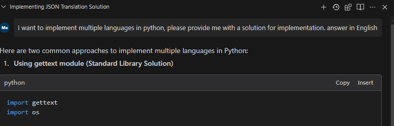
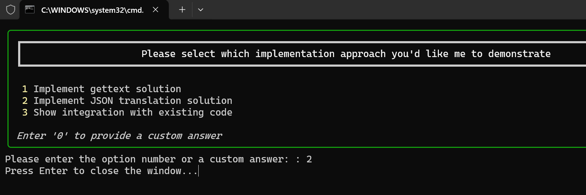
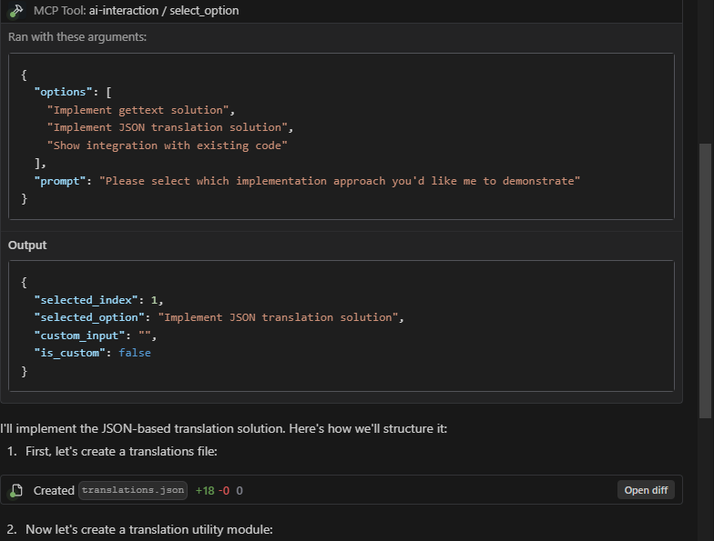

# MCP 交互式服务

这是一个使用 FastMCP 库实现的 MCP 服务，专为与 Cursor、Windsurf 等 AI 工具交互而设计。当 AI 工具在调用大型语言模型过程中需要用户输入或选择选项时，可以调用此 MCP 服务。





## 核心目的

该插件的核心目的是实现 AI 工具（如 Cursor 和 Windsurf）与用户之间的高频通信和确认。它通过以下方式显著提高 AI 交互的效率和有效性：

1. **减少资源浪费**：通过允许用户在 AI 提交到潜在错误的解决方案路径之前确认或重定向 AI 的方法，该插件最大限度地减少了 API 调用和计算资源的浪费。

2. **最大化资源利用**：对 Cursor 或 Windsurf 的每次 API 调用都变得更加高效，因为 AI 可以在继续之前与用户确认其理解和方法。

3. **防止注意力分散**：通过提前确认方法，该插件有助于保持对正确解决方案路径的关注，而不是将注意力转移到错误的方法上。

4. **支持交互式决策**：用户可以积极参与决策过程，向 AI 提供即时反馈和指导。

5. **简化复杂任务**：对于多步骤任务，该插件确保在每个关键决策点上用户期望与 AI 执行之间的一致性。

## 功能特点

- **选项选择**：显示选项列表供用户通过输入数字或提供自定义答案进行选择
- **信息补充**：当 AI 模型需要更完整的信息时，可以请求用户直接输入补充信息
- **多种用户界面**：支持 CLI、Web 和 PyQt 界面

## UI 类型

本项目支持三种不同的用户界面类型，每种都有自己的特点：

### CLI（命令行界面）

- **描述**：为用户交互打开新的命令提示窗口
- **优点**：
  - 最少的依赖性（不需要额外的包）
  - 可以同时处理多个对话窗口
  - 在没有图形界面的环境中工作良好
  - 轻量级且启动快速
- **缺点**：
  - 基本的视觉呈现
  - 对非技术用户可能不太直观
- **最适合**：服务器环境、资源有限的系统，或需要多个同时对话的情况

### PyQt 界面

- **描述**：使用 PyQt 提供现代图形用户界面
- **优点**：
  - 整洁、专业的对话框外观
  - 熟悉的桌面应用程序体验
  - 对所有用户类型都易于使用
- **缺点**：
  - 一次只能显示一个对话框
  - 需要 PyQt 依赖（安装较大）
- **最适合**：视觉吸引力很重要且一次只需要一个对话框的桌面使用环境

### Web 界面

- **描述**：在 Web 浏览器中打开对话框
- **优点**：
  - 可以同时处理多个对话窗口
  - 通过 Web 浏览器可从任何地方访问
  - 现代、可定制的界面
- **缺点**：
  - 需要安装 Web 浏览器
  - 设置稍微复杂
- **最适合**：远程访问场景、首选 Web 界面的环境，或需要多个同时对话的情况

## 使用指南

### 1. 安装依赖

本项目根据不同的 UI 类型分离依赖：

- `requirements-base.txt`：基础依赖，所有 UI 类型共享
- `requirements-pyqt.txt`：PyQt5 UI 依赖
- `requirements-web.txt`：Web UI（Flask）依赖

您可以选择使用传统的 pip 或更快的 uv 包管理器来安装依赖。

#### 使用 pip（传统方法）

根据您想要使用的 UI 类型选择适当的依赖文件：

```bash
cd requirements
# CLI UI（最小依赖）
pip install -r requirements-base.txt

# PyQt5 UI
pip install -r requirements-pyqt.txt

# Web UI
pip install -r requirements-web.txt
```

注意：每个特定的 UI 依赖文件已经包含对基础依赖的引用（通过 `-r requirements-base.txt`），因此您只需要安装一个文件。

#### 使用 uv（推荐，更快）

如果您已经安装了 [uv](https://github.com/astral-sh/uv)，可以使用以下命令创建虚拟环境并安装依赖：

```bash
# 创建虚拟环境
uv venv

# 激活虚拟环境
# Windows
.venv\Scripts\activate

# macOS / Linux
source .venv/bin/activate

# 根据 UI 类型安装依赖
cd requirements

# CLI UI（最小依赖）
uv pip install -r requirements-base.txt

# PyQt5 UI
uv pip install -r requirements-pyqt.txt

# Web UI
uv pip install -r requirements-web.txt
```

您也可以使用项目的 pyproject.toml 文件直接安装所有依赖：

```bash
# 安装基础依赖
uv pip install -e .

# 安装特定 UI 类型依赖
uv pip install -e ".[pyqt]"     # PyQt5 UI
uv pip install -e ".[web]"      # Web UI
uv pip install -e ".[all]"      # 所有 UI 类型
```

### 2. 启动程序

启动不同的 UI 响应方法：

```bash
# 命令行界面（默认）
python main.py run --ui-type=cli

# Web 界面
python main.py run --ui-type=web

# PyQt 界面
python main.py run --ui-type=pyqt
```

其他服务启动选项：

```bash
# 使用默认设置启动服务（地址：127.0.0.1，端口：8000）
python main.py run

# 指定主机和端口
python main.py run --host 0.0.0.0 --port 8888

# 指定日志级别
python main.py run --log-level debug
```

### 3. 配置 Cursor 或 Windsurf

#### 使用 stdio 协议（推荐）

stdio 协议是最稳定和推荐的连接方式，它通过标准输入/输出直接与 Python 脚本通信，具有以下优势：

- 更高的稳定性和可靠性
- 可以同时弹出多个对话框
- 简单直接，无需处理网络连接问题
- 与系统集成更紧密，响应更快

配置示例：

```json
{
  "ai-interaction": {
    "command": "python",
    "args": ["path/to/main.py", "run", "--transport", "stdio", "--ui-type", "cli"],
    "env": {}
  }
}
```

#### 使用 SSE 协议（替代方案）

如果您需要通过网络连接到远程服务器，可以使用 SSE 协议：

本地启动：
```bash
python main.py run --transport sse
```

Cursor 配置：
```json
{
  "ai-interaction": {
    "type": "sse",
    "url": "http://127.0.0.1:8000/sse",
    "env": {}
  }
}
```

Windsurf 配置：
```json
{
  "ai-interaction": {
    "serverUrl": "http://127.0.0.1:7888/sse",
    "disabled": false
  }
}
```

### 4. 配置 AI 交互规则

为了最大化 Cursor 和 Windsurf 中 AI 交互的有效性，为 AI 配置以下在使用 MCP 时遵循的规则：

1. 当 AI 对任务不清楚或需要额外信息时，应该调用 MCP ai-interaction 向用户请求澄清。

2. 当 AI 有多种可能的解决方案方法时，应该调用 MCP ai-interaction 让用户选择首选方法。

3. 完成任务后，AI 应该调用 MCP ai-interaction 确认是否有需要执行的其他任务。

4. AI 应该将任务分解为多个阶段，在开始新阶段之前，调用 MCP ai-interaction 询问用户是否需要纳入任何额外的想法或考虑。

5. AI 应该主动使用 MCP 确认关键决策，而不是做出假设。

这些规则确保高质量、交互式的 AI 辅助，同时最大化每次 API 调用的价值。

### 其他功能

#### 查看可用工具

```bash
python main.py list-tools
```

#### 测试工具

```bash
# 测试选项选择工具
python main.py test select_option

# 测试信息补充工具
python main.py test request_additional_info
```

#### 交互式测试客户端

本项目包含一个交互式测试客户端，可用于测试不同UI类型和方法的MCP服务：

```bash
# 运行交互式测试客户端
python mcp_client_en.py --host localhost --port 7888 --ui cli
```

选项：
- `--host`：服务器主机（默认：localhost）
- `--port`：服务器端口（默认：7888）
- `--ui`：要使用的UI类型（cli、pyqt、web）

客户端提供：
- 与MCP服务的连接测试
- 选择要测试的UI类型
- 测试 select_option 和 request_additional_info 两种方法
- 每种方法的多种参数预设
- 请求和响应的完整可视化

这特别适用于：
- 调试UI交互问题
- 测试不同UI类型的行为
- 向用户演示服务
- 验证服务器功能

#### STDIO 测试客户端

为了专门测试 stdio 传输协议，我们提供了一个命令行工具：

```bash
# 使用默认设置测试 stdio 连接
python mcp_client_stdio.py

# 指定 UI 类型
python mcp_client_stdio.py --ui=pyqt

# 测试特定工具
python mcp_client_stdio.py --test=select_option
```

更多详情请参阅 [STDIO 测试指南](README_STDIO_TEST.md)。

#### UI 测试

```bash
# 测试 PyQt 界面
python test_ui.py --ui-type=pyqt

# 测试 Web 界面
python test_ui.py --ui-type=web

# 测试 CLI 界面
python test_ui.py --ui-type=cli
```

## 工具描述

### 选项选择 (select_option)

此工具用于向用户呈现一组选项，并让他们通过输入数字或提供自定义答案进行选择。

参数：
- `options`：选项列表，可以是字符串列表或字典
- `prompt`：显示给用户的提示消息

返回：
包含选择结果的字典，格式如下：
```json
{
    "selected_index": 0,     // 用户选择的索引，如果是自定义答案则为 -1
    "selected_option": {},   // 用户选择的选项内容
    "custom_input": "",      // 用户的自定义输入（如果有）
    "is_custom": false       // 是否是自定义答案
}
```

### 信息补充 (request_additional_info)

此工具用于向用户请求补充信息。

参数：
- `prompt`：请求信息的提示
- `current_info`：当前信息，显示给用户作为参考

返回：
用户输入的补充信息（字符串）

## 与 AI 工具集成

要将此 MCP 服务与 AI 工具集成，请按照以下步骤操作：

1. 启动 MCP 服务：`python main.py run`
2. 在 AI 工具中配置 MCP 端点，根据需要选择使用 stdio 或 SSE 协议
3. 当 AI 模型需要用户输入或选项选择时调用适当的 MCP 工具

## 示例

### 选项选择示例

```python
from fastmcp import Client

async with Client("http://127.0.0.1:8000/sse") as client:
    options = [
        "选项 1：使用 TensorFlow 实现",
        "选项 2：使用 PyTorch 实现",
        {"title": "选项 3：使用 JAX 实现", "description": "更适合研究目的"}
    ]
    result = await client.call_tool(
        "select_option", 
        {"options": options, "prompt": "请选择一个框架实现"}
    )
    selected_option = result.json
    print(f"用户选择: {selected_option}")
```

### 信息补充示例

```python
from fastmcp import Client

async with Client("http://127.0.0.1:8000/sse") as client:
    additional_info = await client.call_tool(
        "request_additional_info",
        {
            "prompt": "请提供具体项目需求",
            "current_info": "这是一个数据分析项目"
        }
    )
    print(f"用户提供的信息: {additional_info.text}")
```

## 开发注意事项

- 除非您需要开发或测试多种 UI 类型，否则建议只安装一种 UI 依赖
- 如果需要添加新依赖，请将其添加到适当的依赖文件中

## 当前开发状态

请注意实现的以下状态：

- **Windows**：CLI 和 PyQt UI 版本功能齐全。Web UI 仍有一些问题需要解决。
- **Linux/Mac**：这些平台尚未经过全面测试。您的体验可能会有所不同。

我们正在积极改进所有平台和 UI 类型的兼容性。

## 许可证

本项目在 MIT 许可证下发布。 